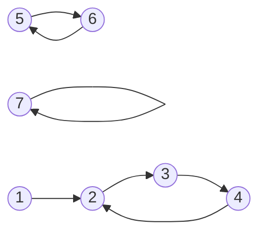

#graph #graph/functional-graph #graph/functional-graph/loop


のような**functional graph**があったとき、
それぞれループの検出を行いたいとき、以下のようにかける

```kotlin
    val vis = sizedIntArray(N, -1)
    var ans = 0
    for (i in 0 until N) {
        var u = i
        while (true) {
			// すでに検知判定が完了しているノードに来たか(打ち切り)
            if (vis[u] != -1 && vis[u] != i) break
			// 検知判定中に同じノードに到達した場合(ループ検出+長さ計算)
            if (ord[u] != -1) {
			    // 何かしら処理
                break
            }
			// 起点となるノードから到達したことをメモ
			//   visにiと入れることで、
			//   次の起点から処理したときにすでに判定が完了しているかを判別可能
            vis[u] = i
            u = A[u]
        }
    }
```

## ループの長さ
ループ検出時の処理として例えばループの長さを計算したい場合、
起点のノードからなんステップ進んだかを別途メモしておくことで簡単に計算できる

```kotlin
    val vis = sizedIntArray(N, -1)
	val ord = sizedIntArray(N, -1)
    var ans = 0
    for (i in 0 until N) {
        var u = i
		var k = 0
        while (true) {
			// すでに検知判定が完了しているノードに来たか(打ち切り)
            if (vis[u] != -1 && vis[u] != i) break
			// 検知判定中に同じノードに到達した場合(ループ検出+長さ計算)
            if (ord[u] != -1) {
				// ※ここを追加
				//   2回目に訪れたとき、kはループの長さ分だけ増えている
				ans += k - ord[u]
                break
            }
			// 起点となるノードから到達したことをメモ
			//   visにiと入れることで、
			//   次の起点から処理したときにすでに判定が完了しているかを判別可能
            vis[u] = i
			// ※ここを追加
			ord[u] = k
			k++
            u = A[u]
        }
    }
```